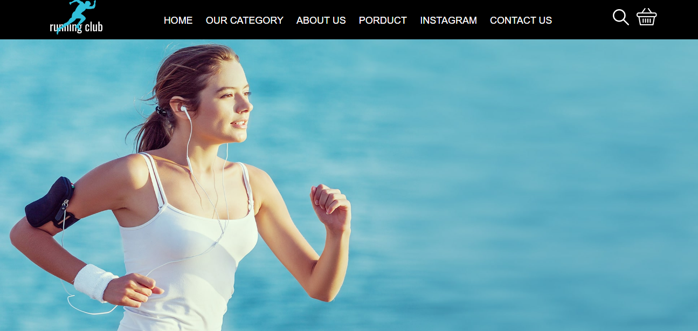
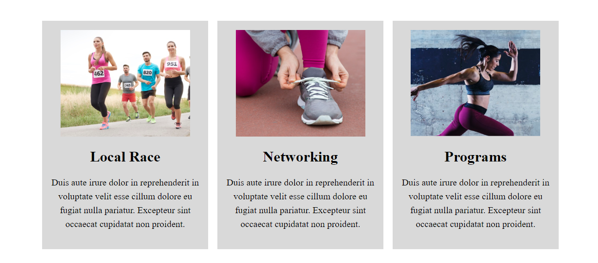
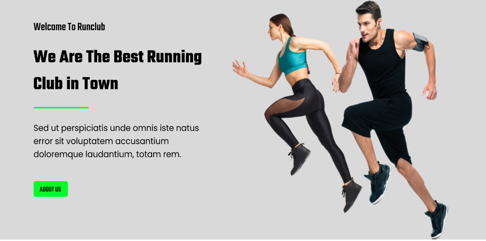
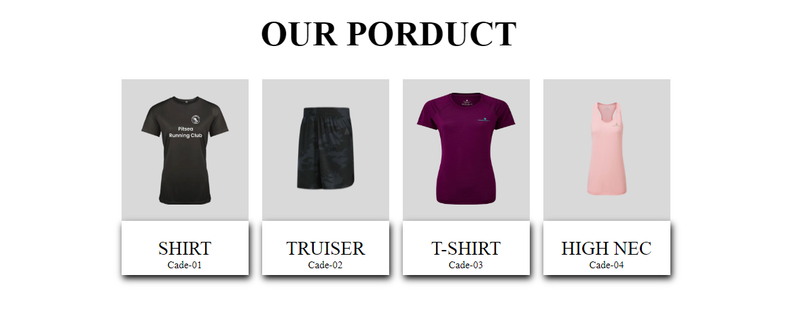

# Pagina web para veterinarias
esta página web es totalmente personalizable ya que solamente cuenta con un archivo HTML donde se encuentra toda la estructura de la página y un archivo CSS donde se agrega el estilo visual 
de la página haciendo más llamativa, ademas es importante contar con un editor de texto como VScode para poder realizar las modificaciones necesarias al código.

## Capturas

 |   |
| :---: | :---: |
|  |   |

## Tecnologías utilizadas

